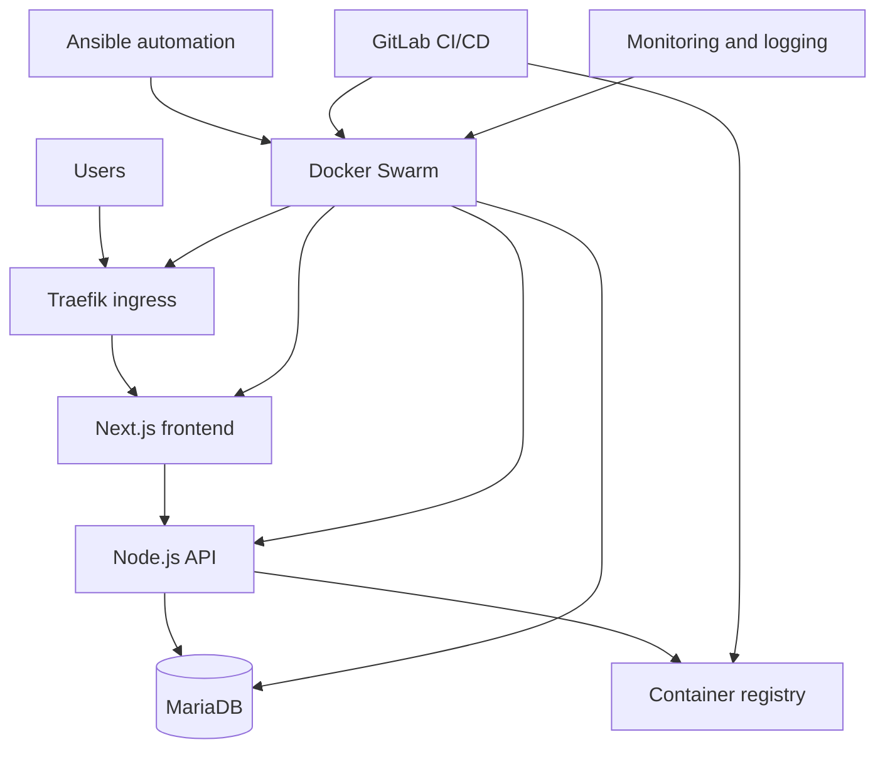

# Quantum Motors Platform

A full-stack and infrastructure platform for the Quantum Motors project. The repository brings together the web applications, deployment automation, infrastructure-as-code, observability stack and operational documentation needed to run the platform.

## Platform Architecture



## Repository Map

- `ansible/`: inventories, playbooks and reusable infrastructure roles
- `clo5-backend-master/`: Node.js API with Prisma and database integration
- `clo5-front-main/`: Next.js frontend
- `deploy/`: pre-production, production blue/green, database, Traefik, logging and monitoring manifests
- `docker/`: local MariaDB initialization assets
- `docs/`: architecture, procedures, CI/CD and operations runbooks
- `tests/`: functional and smoke-test tooling

## Local Development

Requirements: Docker and Docker Compose.

```bash
docker compose up --build -d
```

Typical local endpoints:

- Frontend: `http://127.0.0.1:4200`
- Backend: `http://127.0.0.1:3000`

Stop the stack with:

```bash
docker compose down
```

## Infrastructure Workflow

The `docs/` directory is the operational entry point. Start with the prerequisite and Vault procedures, then review the deployment, monitoring, backup and CI/CD runbooks before using Ansible against an environment.

## Configuration and Security

Use the example environment files as templates and inject secrets through a secure local or CI/CD mechanism. Real `.env` files, credentials, Vault passwords, private keys and production configuration must never be committed.

## Documentation Highlights

- `docs/etape-0bis-documentation-technique.md`: current technical documentation
- `docs/etape-2-architecture-microservices.md`: service architecture proposal
- `docs/etape-2-sre-excellence.md`: reliability and operations practices
- `docs/SOUTENANCE-PARTIE2-RUNBOOK.md`: presentation and validation runbook

## Status

Academic full-stack, infrastructure and SRE project developed as part of the ETNA curriculum.