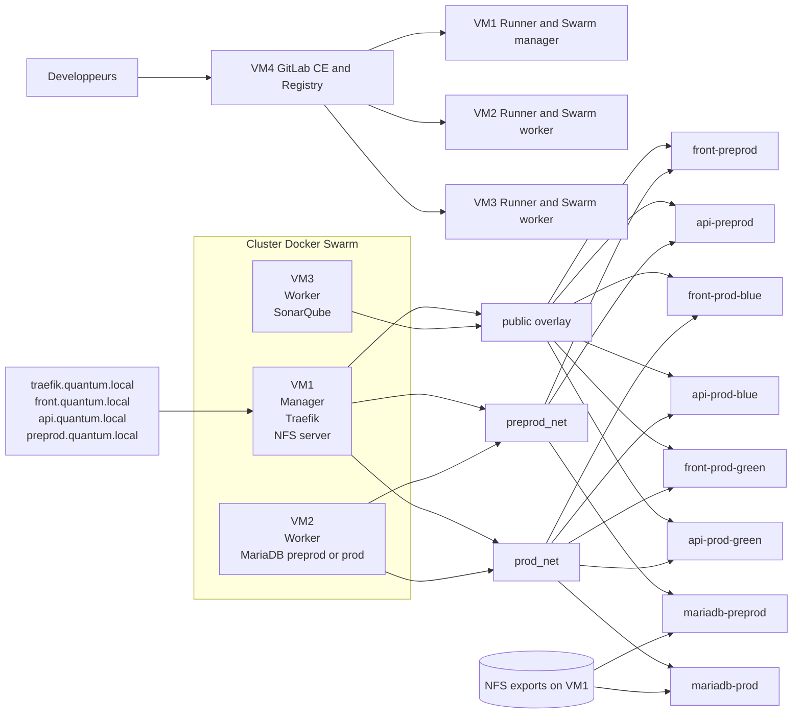

# Etape 0-bis - Schema d'infrastructure

Etat documente le `2026-04-04`.

## Vue d'ensemble

## Repartition des VMs

| VM | Role principal | Services |
| --- | --- | --- |
| `VM1` | Swarm manager | Traefik, runner GitLab, export NFS |
| `VM2` | Swarm worker | runner GitLab, MariaDB preprod/prod |
| `VM3` | Swarm worker | SonarQube, runner GitLab |
| `VM4` | Hors cluster | GitLab CE, registry GitLab |

## Domaines utilises

- `preprod.quantum.local`
- `api-preprod.quantum.local`
- `front-blue.quantum.local`
- `api-blue.quantum.local`
- `front-green.quantum.local`
- `api-green.quantum.local`
- `front.quantum.local`
- `api.quantum.local`
- `traefik.quantum.local`

## Evolutions majeures par rapport a l'etape 0

- ajout du cluster `Docker Swarm` sur `VM1`, `VM2`, `VM3`
- ajout de `SonarQube` sur le cluster
- ajout de `GitLab CE` sur `VM4`
- ajout de `GitLab Runner` sur les noeuds Swarm
- ajout de `Traefik` pour l'entree HTTP et le blue/green
- ajout d'un stockage `NFS` pour la persistance MariaDB
- ajout des environnements `preprod`, `prod blue` et `prod green`
