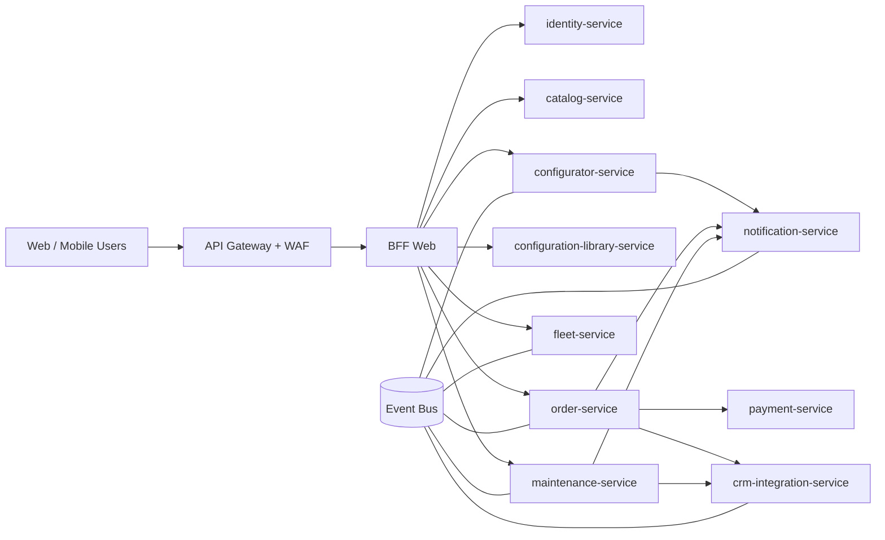

# SPE-CLO5 / Quantum Motors - Partie 2

Document date du `2026-05-28`.

## 0. Priorite metier (avant tout)

La priorite fonctionnelle de la plateforme Quantum Motors est:

1. commander un vehicule dans differents points de vente
2. gerer et sauvegarder les configurations utilisateur dans un compte
3. permettre aux entreprises de gerer leur flotte de vehicules
4. planifier les entretiens
5. connecter les formulaires et commandes au CRM Quantum Motors

La proposition microservices ci-dessous est organisee en premier lieu pour couvrir ces 5 besoins metier, puis pour repondre aux contraintes de disponibilite, scalabilite, performance, fiabilite et securite.

## 1. Architecture existante et limites

L'existant du projet est base sur:

- un frontend Next.js
- une API backend unique
- une base MariaDB unique
- un deploiement Swarm preprod/prod (blue/green)

Cette architecture a permis de livrer rapidement mais atteint ses limites face aux nouvelles demandes metier:

- disponibilite internationale: le backend unique concentre les risques de panne
- scalabilite: impossible de scaler finement uniquement les domaines les plus charges
- performances: toutes les fonctionnalites partagent la meme base et les memes ressources
- fiabilite: les incidents d'un domaine impactent l'ensemble de la plateforme
- securite: surface d'attaque concentree (API monolithique + donnees multi-usages dans un meme perimetre)

## 2. Proposition d'architecture microservices

Le decoupage cible est oriente "bounded contexts" metier.

### 2.1 Domaines fonctionnels proposes

1. `identity-service`
- authentification, comptes, roles, consentement RGPD

2. `catalog-service`
- modeles, batteries, finitions, couleurs, options, media

3. `configurator-service`
- creation/edition d'une configuration utilisateur, calcul de prix, compatibilites

4. `configuration-library-service`
- sauvegarde/reprise/partage des configurations dans le compte utilisateur

5. `order-service`
- panier, commande, statut, rapprochement point de vente, historique

6. `payment-service`
- integration PSP, tokenisation, suivi transactionnel

7. `fleet-service`
- gestion flotte entreprise, affectation vehicules, vues administratives B2B

8. `maintenance-service`
- planification d'entretiens, rappels, historique maintenance

9. `crm-integration-service`
- synchronisation CRM (contacts, formulaires, leads, commandes)

10. `notification-service`
- emails/SMS/webhooks (commande, entretien, comptes, incident client)

### 2.2 Mapping explicite des besoins metier vers les services

| Besoin metier prioritaire | Services principaux | Integrations | Donnees maitrisees |
| --- | --- | --- | --- |
| Commander un vehicule en point de vente | `order-service`, `payment-service`, `catalog-service`, `identity-service` | CRM, PSP, notifications | panier, commande, statut paiement, point de vente, historique |
| Sauvegarder les configurations utilisateur | `configurator-service`, `configuration-library-service`, `identity-service` | notifications | configuration, revisions, favoris, partage |
| Gerer une flotte entreprise | `fleet-service`, `order-service`, `identity-service` | CRM, notifications | parc vehicules, affectations, droits B2B, contrats internes |
| Planifier les entretiens | `maintenance-service`, `fleet-service`, `notification-service` | CRM, agenda externe (option) | plans d'entretien, rappels, historique interventions |
| Connecter les formulaires/commandes au CRM | `crm-integration-service`, `order-service`, `identity-service` | CRM Quantum Motors | leads, contacts, synchro commandes, traces d'echange |

### 2.3 Vue cible (logique)

### 2.4 Principes d'implementation

- `Database per service`: chaque service possede son schema et ses migrations
- `API Gateway`: point d'entree unique (authN/authZ, rate limiting, observabilite)
- `Communication synchrone`: HTTP/gRPC pour lecture et commande immediate
- `Communication asynchrone`: bus d'evenements pour workflows inter-domaines
- `Strangler Pattern`: migration progressive depuis le backend actuel

### 2.5 Parcours fonctionnels cibles (end-to-end)

1. Parcours "commande vehicule":
- utilisateur authentifie -> configurateur -> panier -> paiement -> creation commande -> sync CRM -> notification client

2. Parcours "sauvegarde configuration":
- utilisateur authentifie -> creation configuration -> sauvegarde bibliotheque -> reprise/modification -> partage optionnel

3. Parcours "flotte entreprise":
- admin entreprise -> creation parc -> ajout vehicules -> affectation conducteurs -> suivi statut vehicules

4. Parcours "entretien":
- vehicule actif -> calcul echeance entretien -> creation tache -> rappel automatique -> cloture intervention

5. Parcours "CRM":
- formulaire contact ou commande -> publication evenement -> transformation -> envoi CRM -> accuse de reception -> reprise sur erreur

## 3. Reponse aux contraintes du sujet

### Haute disponibilite

- replicas par service (au lieu d'un backend unique)
- healthchecks stricts et redemarrage auto
- separation des domaines pour limiter le blast radius
- preparation multi-region (edge CDN + routage geo + replication asynchrone)

### Scalabilite et performance

- autoscaling horizontal service par service
- cache cible (catalogue, lecture config frequente)
- isolation des charges lourdes (payment, CRM, maintenance) hors chemin critique configurateur

### Fiabilite (SRE)

- SLI/SLO par domaine metier (checkout, configurateur, CRM sync, etc.)
- error budget et alerting par service
- runbooks d'incident et post-mortems
- instrumentation logs + metrics + traces des flux critiques

### Securite

- IAM central (OIDC/OAuth2), JWT courts + refresh
- chiffrement TLS en transit, chiffrement au repos
- secrets en coffre (Vault), rotation credentials
- segmentation reseau inter-services et principe du moindre privilege
- journal d'audit sur actions sensibles (commande, donnees perso, flotte)

## 4. Plan de livraison priorise (roadmap metier)

### Lot A - valeur immediate (MVP plateforme)

1. `identity-service`
2. `catalog-service`
3. `configurator-service`
4. `configuration-library-service`
5. `order-service`
6. `crm-integration-service` (flux minimal commande + contact)

Objectif: couvrir commande + sauvegarde configuration + CRM minimum.

### Lot B - extension business B2B

1. `fleet-service`
2. extension `crm-integration-service` pour process entreprise
3. dashboards metier dedies B2B

Objectif: gestion flotte entreprise exploitable.

### Lot C - excellence operationnelle

1. `maintenance-service`
2. `notification-service`
3. alerting metier SLO/SLA

Objectif: planification entretien et fiabilite long terme.

## 5. Mapping cible sur le cluster actuel (phase de transition)

Sur les 4 VMs actuelles, la cible est atteinte par etapes:

1. Garder l'application existante en production avec Traefik + Swarm.
2. Introduire `API Gateway` et router progressivement des routes vers de nouveaux services.
3. Extraire d'abord les domaines a fort impact metier:
- `identity-service`
- `order-service`
- `crm-integration-service`
4. Continuer l'extraction par lots (configurations sauvegardees, flotte, maintenance).

Ce mode reduit le risque de rupture tout en restant compatible avec la contrainte de temps/ressources du module.

## 6. Monitoring et tableaux de bord (Partie 2)

La plateforme deployee inclut:

- `Loki + Alloy + Grafana` pour les logs applicatifs/infrastructure
- `Prometheus + Node Exporter + cAdvisor` pour les metriques systeme et conteneurs
- `Uptime Kuma` pour une status page non-technique

Deux vues sont donc disponibles:

1. Vue non-tech (`status.quantum.local`):
- etat Up/Down par service
- historique d'indisponibilite (bonus incidents)

2. Vue technique (`logs.quantum.local`):
- dashboard "Quantum Motors - Service & Infrastructure Monitoring"
- metriques nodes (CPU, RAM, disque), charge services et erreurs logs (5xx, exceptions)
